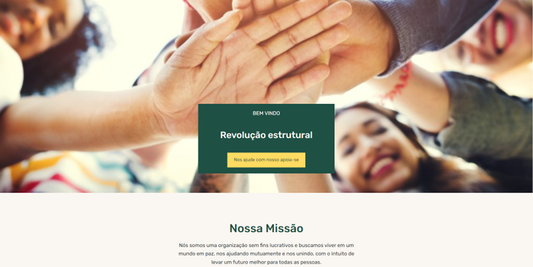

# Diário de Bordo - Setembro  -
---
Semana 26 - 05/09 á 09/09

Adquirimos a versão Pro do WordPress, o que facilitou a adição de novas ferramentas ao site, elevando o design do projeto para algo mais profissional.

Adquirimos os depoimentos de profisionais da psicologia, tanto para atestar a qualidade do site, quanto, para descrever as doenças relacionadas.

---

Semana 27 - 12/09 á 16/09

Criação do domínio do site, para que o mesmo, possa estar no ar. Além da implementação de novos recursos visuais que deixam o site mais navegável e agradável visualmente.

---

Semana 28 - 19/09 á 23/09

Confecção do pôster do projeto e finzalização do site, além da criação de um novo logo.

